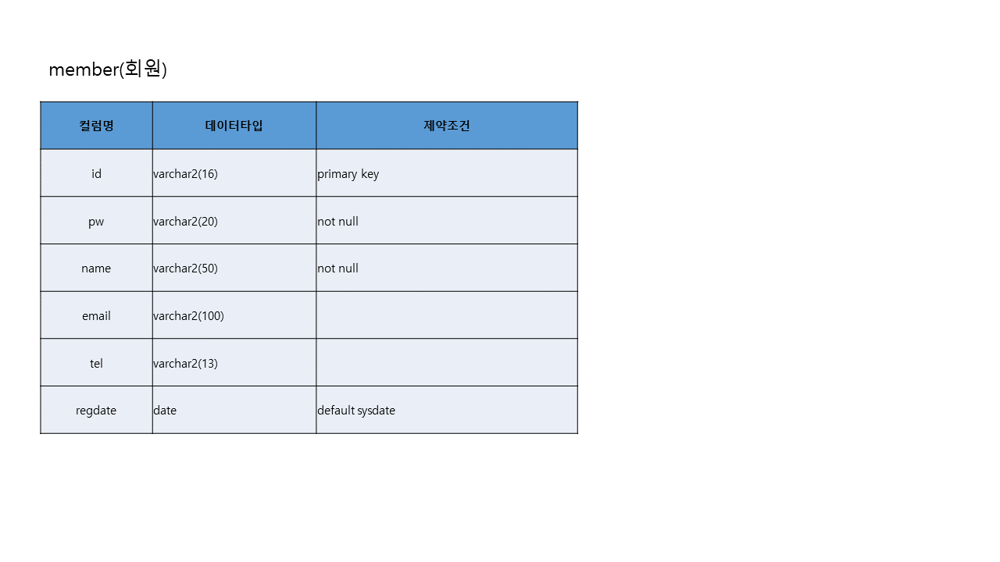

# 프로젝트
## 프로젝트 개요
"삼천리자전거" 라는 기업을 주제로  프론트엔드 쪽에선 Visual Studio Code라는 프로그램을 사용하였고, jsp 의 디렉티브,스크립트릿,표현식만 활용하여 기업별 
데스크탑 웹 애플리케이션을 작성하였으며, 해당 프로젝트는 회원기능인 회원가입, 로그인, 로그아웃, 회원 정보 확인, 회원 정보 수정, 회원 탈퇴, 회원의 게시판 글 목록 , 온라인 상담 메일 보내기, 글 상세보기 등을 구현하였으며,
관리자는 일반 회원의 관리기능인 회원 정보 수정, 회원 강제 탈퇴, 회원통계, 글 관리 기능 등을 구현하였음

## 프로젝트 설계

## 프로젝트 기능 구현 
!

 
